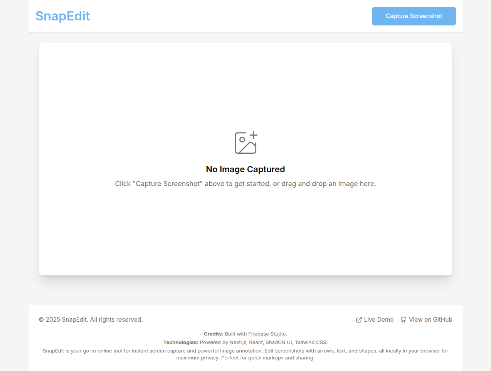
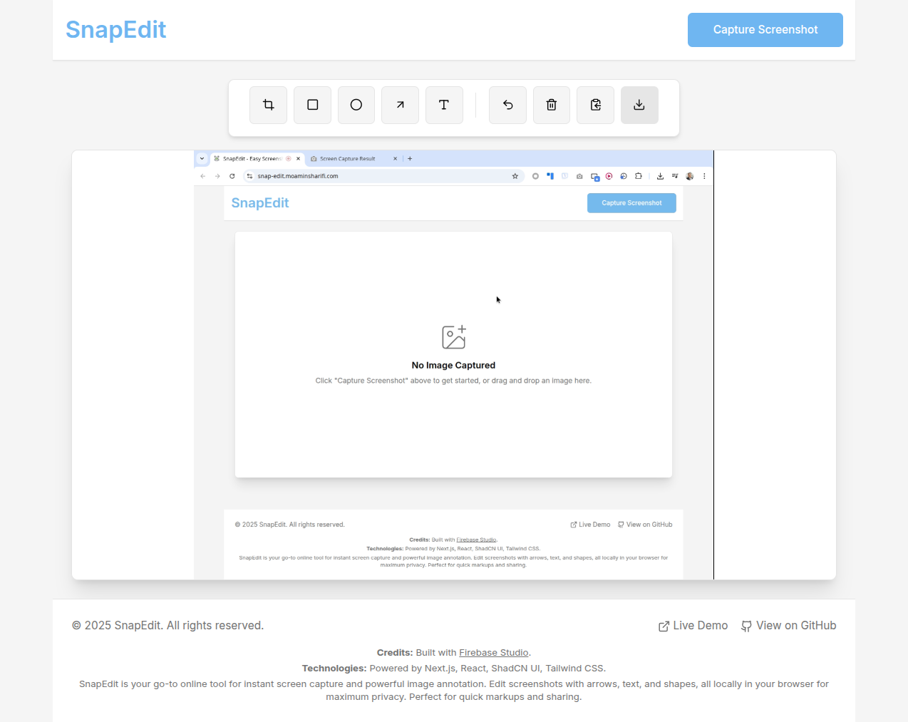

# SnapEdit


# SnapEdit - Your Go-To Screenshot Capture & Annotation Tool

SnapEdit is your go-to online tool for instant screen capture and powerful image annotation. Built with Next.js in Firebase Studio, it allows users to quickly capture their screen, annotate with professional tools (arrows, text, shapes), and share their screenshots. Designed for speed and privacy, with all processing done locally in your browser.

**🚀 Live Demo:** [https://snap-edit.moaminsharifi.com/](https://snap-edit.moaminsharifi.com/)

**📂 GitHub Repository:** [https://github.com/moaminsharifi/snap-edit](https://github.com/moaminsharifi/snap-edit)

## ✨ Features

### 📸 **Capture Methods**
- **Screen Capture:** Instantly capture your entire screen, specific window, or browser tab
- **Drag & Drop:** Simply drag and drop existing images for quick annotation
- **Multiple Input Options:** Flexible ways to get your images into the editor

### 🎨 **Powerful Annotation Tools**
- **Crop:** Trim your screenshots to focus on what matters
- **Rectangle:** Add rectangular highlights and frames  
- **Circle:** Create circular annotations and callouts
- **Arrow:** Point out important details with directional arrows
- **Text:** Add custom text labels and descriptions
- **12-Color Palette:** Choose from a vibrant selection of colors for all annotations

### ⚡ **Quick Actions**
- **Undo Functionality:** Easily revert your last action
- **Clear Canvas:** Start fresh by clearing all annotations
- **Download Image:** Save your edited screenshot as a high-quality PNG
- **Copy to Clipboard:** Instantly copy the edited image for quick sharing

### 🔒 **Privacy & Performance**
- **100% Local Processing:** All image editing happens in your browser - no uploads required
- **Maximum Privacy:** Your screenshots never leave your device
- **Lightning Fast:** No server delays, instant editing and processing
- **Responsive Design:** Works seamlessly across desktop, tablet, and mobile devices

## 🛠️ **Built With Modern Technology**

- **Next.js** - React framework for production
- **React** - Component-based UI library  
- **Firebase Studio** - Development and deployment platform
- **ShadCN UI** - Modern component library
- **Tailwind CSS** - Utility-first CSS framework

## 🚀 Getting Started

This project is optimized for Firebase Studio but can run in any Next.js environment.

### **Quick Start**
1. **Explore the Code:** Check out `src/app/page.tsx` for the main entry point and `src/components/snapedit/SnapEditApp.tsx` for core functionality
2. **Run Locally:**
   ```bash
   npm install
   npm run dev
   ```
   The development server will start on `http://localhost:9002`

### **Usage**
1. Click "Capture Screenshot" to grab your screen (or a window/tab)
2. Or drag and drop an existing image
3. Use the annotation tools to markup your image
4. Download or copy to clipboard when finished


## 📸 Screenshots



*Clean, intuitive interface designed for quick screenshot editing*

## 🏗️ How It Works

SnapEdit leverages modern browser APIs to deliver a seamless experience:

- **Screen Capture API** (`navigator.mediaDevices.getDisplayMedia`) for screen recording
- **HTML5 Canvas API** for image manipulation and real-time annotation
- **File API** for drag-and-drop image handling
- **Clipboard API** for instant sharing capabilities

All operations are performed entirely in your browser, ensuring zero data transmission and maximum privacy.

## 📁 Project Structure

```
src/
├── app/
│   ├── page.tsx              # Main application entry point
│   └── layout.tsx            # Root layout with SEO metadata
├── components/
│   ├── snapedit/
│   │   ├── SnapEditApp.tsx           # Core application logic
│   │   ├── EditorToolbar.tsx         # Tool selection and actions
│   │   └── ScreenshotCanvas.tsx      # Canvas rendering and interactions
│   └── ui/                   # ShadCN UI components
```

## 🔐 Privacy First

Privacy is at the core of SnapEdit's design philosophy:

- **No Data Collection:** We don't collect, store, or analyze your screenshots
- **Local Processing:** All editing happens on your device
- **No Server Uploads:** Your images never leave your browser
- **Secure by Design:** No external dependencies for image processing

## 🤝 Contributing

We welcome contributions! Please feel free to submit issues and pull requests to help improve SnapEdit.

## 📄 License

This project is open source. See the repository for license details.

---

*Built with ❤️ using Firebase Studio*

